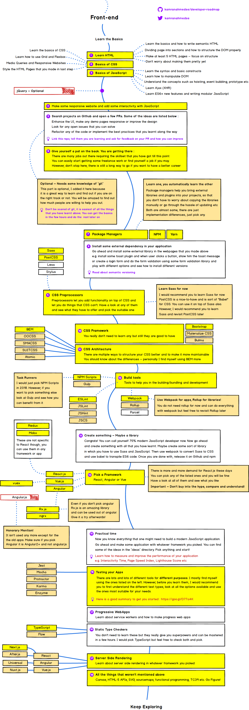

# 4주차 - 180528(월) 이응모강사님

Css property -> 속성
Html attribute -> 요소
한국어로는 비슷해보임
왜 용어에 차이가 있을까?

---
프로그래밍도 언어. 말이 통해야 한다.
프론트엔드 또한 코드를 명확히 이해하고 설명할 수 있어야 한다.
가장 선행되어야 하는 것 : 용어들을 먼저 정확히 이해해야 함!
그래야 학습 및 협업이 가능함.
 두번째, 트렌드를 따라갈 수 있는 능력

진짜 실력이 드러나는 것은 삼년 후다. 삼년 후에 내가 얼마를 받느냐

---
첫 1-2주 동안은 대학교 시험본다고 생각하고 와라
코드를 짜기보다 개념 먼저 할 단계이다!

---
지각, 결석은 금물이고 예복습은 필수.

---
https://poiemaweb.com/coding
강사님은 한 챕터를 정독하는데 3시간이 걸린다. 이 것이 어떤 개념인지 알기 위한 노력까지 포함해서.
예습은 **내일 수업 뭐하는지 훑어보고 오기**
복습은 내가 무엇을 아는지, 무엇을 모르는지를 구분하고 모르는 것은 **부채로 남겨놓아라.** 기술 부채를 인식하고 있을 때 나중에 그 정보가 왔을 때 캐치할 수 있어진다.

---
삼천을 받고 싶나? 내가 왜 삼천을 받을 수 있는지 증거를 대라. 수업에서 다루는 부분은 취업하는데 반드시 알아야 할 부분이기 때문에 이해가 안되는 부분은 이해를 하도록 노력하라. 

---
## Sylabus

coding! ~ Standard Build-in Object까지 이론적으로 굉장히 중요한 파트이니 치중해서 공부하라. 

6주차에 시험을 본다. 과락이 있음. 70점이 기준.

DOM부터 html에 들어간다. single page application(SPA)방식으로 개발하기 때문에 우리가 해야 할 일은 결국 view를 컨트롤 하는 것. 그 부분이 DOM. 7주차 6월 18일부터 실제 웹페이지를 다루는 것. DOM부터는 비동기방식으로 동작한다. 비동기식 처리는 굉장히 불편하지만 따라가야 한다. promise, generate, 최신식으로는 rx-jx. 우리 수업에서는 Angular를 하기 때문에 rxjx를 다뤄볼 수 있다. 하지만 수업과정에 들어가진 않을 것(러닝커브가 굉장히 가파르다) 서버를 다루는 것.

8주차부터는 실습에 들어간다. 6월 25일 Todo App 실습. ES3 - ES5 - ES6. 브라우저가 호환하는 것은 ES5. 지금 주류는 ES6. 그 둘의 코딩 방식의 차이를 이해해야한다. 회사에 들어가서 1, 2년 전에 만들어진 서비스를 유지보수한다면 ES5를 다뤄야 하고 최신 서비스를 만든다면 ES6를 하게 될 것. (지금부터 한달 후)
6월 26일부터 ES6를 배운다. spa방식으로 개발하는데 처음부터 맨땅의 헤딩을 하기는 어려우니 앵귤러, react등의 프레임워크를 배운다.

9주차 : node.js, express, typeScript를 간단하게 배운다.

10주차 : Angular를 배우기 시작한다. react는 라이브러리, Angular는 프레임워크다. 그래서 react보다 공부할 것이 많고 어렵다. 대신 앵귤러가 하라는 방식에 따라서 application을 만들다보면 어플 전체를 설계하는 역량이 생긴다. 앵귤러를 배우면 best design pattern을 익힐 수 있다.

(자스 1개월, 앵귤러 1개월을 배운다. 자스가 선행되지 않으면 앵귤러를 배울 수 없으므로 수업 지각 및 결석을 하지 말 것.)

---
## Programming Language

인간은 자연어로 대화한다.
컴퓨터는 2진수밖에 모른다.
그래서 컴퓨터에게 명령할 때 2진수로 해야하는데 명령하기 어려움 => 컴퓨터도 알고, 나도 아는 중간 언어를 만들자. 인공어를 만들어서 소통하게 하자.

프로그래밍 언어는 Sementic(의미)과 Syntax(문법)의 조합으로 표현된다.

---
## Computational Thinking

컴퓨터가 우리를 고려할 수는 없으니 우리가 컴퓨터를 고려해야 한다. '컴퓨터를 배려하기 위한 것'이라는 맥락이 들어있음. 그러려면 컴퓨터를 잘 알아야 한다.

var foo; 는 단순히 변수 선언이 아니라 컴퓨터로 하여금 메모리를 확보하라는 명령이 들어있다. 명령 하나하나가 컴퓨터에게 어떤 영향을 미치는 지를 알아야 함.**(메모리는 중요하다. 잘 알아야 함)** 

공학을 하는 사람은 명확한 문장을 써야 한다. 주어-목적어-서술어. 명확한 문장을 서술해야 코딩 또한 명확해진다. 

내가 아는지 모르는지 확인할 수 있는 가장 확실한 방법은 설명해보는 것이다.

우리의 말이 코드가 된다. 뇌를 명확한 문장을 구조하도록 가다듬어야 코드가 명확하게 나온다.

---
## JavaScript Introduction

자바스크립트는 웹 브라우저에서 OS가 동작시킴.(더 구체적으로는 브라우저 안에 있는 자바스크립트 엔진이 동작시킨다.)

html은 1989년 Tim Berners Lee가 만듬. -> CSS. 1994. -> JavaScript. 1995. 넷스케이프, 모질라재단의 Brendan Eich.

JScript와 JavaScript의 파편화가 심해져서 ECMA재단에 표준안을 만들어 달라고 요청.

---
## Application vs Web site

Application : OS에서 작동

Web site : 웹 브라우저에서 작동

Web Application(Web App) : 웹브라우저에서 앱처럼 작동. 보완상 문제 때문에 플러그인을 통해 했는데, 플러그인에 종속됨.

그것을 해결하기 위해 나온 것이

HTML5 -> 보완하기 위해 나온 것 jQuery. 

But, jQeury는 html페이지가 바뀌면 같이 바뀐다. SPA에서는 안쓴다. -> react, angular가 나옴

더글라스 크락포드 '자바스크립트 핵심 가이드'

--- 
## JavaScript의 특징

클래스 기반의 언어로 하는 방식이 아니라 프로토타입 기반이기 떄문에 다르다. 객체가 함유하는 의미. '나 이외의 것', '프로그래밍 하는 대상들을 하나의 오브젝트로 생각한다.'

자스를 잘 배워놓으면 활용도가 높다. 깊숙히 할 필요가 있다. 프로토 타입이 무엇인지까지. 굉장히 확장성이 있다.

이 코드가 왜 이렇게 짜여졌는지까지 이해하는 것.

수업시간에 이해가 되었다고 해도, 다음날이면 잊어먹는다. 자기의 것으로 바꾸는 것이 필요하다.

강사님 생각에, HTML, CSS 동작 원리까지 이해하는것은 상당히 어렵다. 개인적으로 자스보다 더 어렵게 느낌.

['why learning to code is so damn hard'](https://www.thinkful.com/blog/why-learning-to-code-is-so-damn-hard/
) 유명한 글을 읽어라!




자스로 코딩한 다음 babel을 사용해서 컴파일해주면(trans-piling)을 해주면 브라우저 서포트는 크게 문제가 되지 않는다. babel, webpack을 같이 사용해야 함. 

---
## JavaScript Syntax
https://poiemaweb.com/js-syntax-basics

JS는 HTML, CSS를 동적으로 조작하는데 관심이 있다. HTML은 문서의 구조화, 데이터(콘텐츠)에 관심이 있고, CSS는 스타일링에 관심이 있다. 관심사가 다르면 분리하는 것이 원칙.

JS는 HTML 안에서 \<head>태그 아래나, \<body>태그 아래에 위치한다. 왜? 브라우저 내부의 parser가 한줄 한줄 텍스트를 위에서부터 읽기 시작한다. 그래서 컴퓨터가 읽을 수 있는 바이트 코드로 바꾸어 메모리에 넣는다. 그러다 \<style> 태그를 만나면 HTML parser가 CSS parser에게 제어권을 넘긴다 -> CSS parser가 CSS코드를 읽어 메모리에 저장 -> \<style> 코드가 끝나면 CSS parser가 HTML parser에게 제어권을 넘김 -> \<script>를 만나면 HTML parser가 JavaScript parser에게 제어권을 넘김.

HTML parser, CSS parser, JavaScript parser가 읽은 세가지의 것을 합침 -> DOM tree가 만들어짐 -> 그것을 렌더링한다 -> 브라우저에 그려짐

```
<!DOCTYPE html>
<html>
<head>
  <meta charset="UTF-8">
  <meta name="viewport" content="width=device-width, initial-scale=1.0">
  <meta http-equiv="X-UA-Compatible" content="ie=edge">
  <title>Hello World</title>
  <style>
    button { color: red; }
  </style>
</head>
<body>
  <h1 id="heading"></h1>
  <button id="my-btn">click me!</button>

  <script>
    var heading = document.getElementById('heading');
    var myButton = document.getElementById('my-btn');

    myButton.addEventListener('click', function () {
      heading.innerHTML = 'Hello World!';
    });
  </script>
</body>
</html>
```

바디요소의 html요소가 메모리상에 올라가기 전에 script를 읽으면 undefined가 뜬다. DOM을 컨트롤 헤야 한다면 script태그를 바디 태그 아래 쪽에 놓아야 한다. 

**myButton.addEventListener**

event? listener? 사용자가 클릭할 때 그것을 듣는 사람이 있어야 한다. 언제 누를지 정해져 있지않다(비동기)

이벤트를 감시하고 있는 eventListener에게 '이 버튼이 눌려지면 이 행동을 해.'라고 알려주는 것. 

자바스크립트는 모듈화를 지원하지 않는다. 스크립트 태그를 통해 파일 열개를 삽입해도 가장 아래쪽의 파일 하나가 적용이 된다. (그래서 ES6부터 파일을 쪼개 스코프로 지원을 했는데, 브라우저에서 지원하지 않아 결국 웹팩을 써야 한다.)

---
## 브라우저 동작 원리


네이버에 가고 싶다.
서버에 요청을 보낸다('http' or 'https'의 통신 방식으로) -> (DNS 서버가 네이버 서비스를 제공해주는 서버를 알려줌) -> 네이버 서비스를 제공하는 서버를 찾아간다.(클라이언트에서 server로 왔다. 요청했다.) -> server가 index.html(텍스트파일)을 아스키코드로 뿌려준다.(서버가 클라이언트에게 응답. response) -> 클라이언트가 그것을 받아 브라우저에 렌더링.

이런 방식으로 html, css, javascript가 클라이언트-서버간에 request, response를 반복한다.
이것을 보완한 것이 http2. 그러나 지금 사용되는 것은 http1.1이다. 그러나 공부해야 함

---
## JavaScript Syntax Basics

1. Statement

구문은 명령이다. 단계별로 실행된다. 
```
var x = 5;
var y = 6;
var z = x + y;
```
단순한 세 줄의 구문이지만 내포하고 있는 것은 자스 엔진이 첫째줄을 만났을 때 메모리를 일정 영역 확보하고, x라는 이름에 메모리를 할당해서 숫자 데이터 5를 x에 집어넣고, 두번째 줄을 만났을 때 숫자 데이터 6을 y에 집어넣고, 세번째 줄을 만났을 때 메모리를 할당해서 x + y의 값을 꺼내와서 연산한 후에 z에 집어 는 것!

구문은 value(값), operator(연산자), expresstion(표현식), keyword(키워드), comment(주석)로 구성되며 세미콜론( ; )으로 끝나야 한다. 

값은 여러가지 형태를 가지고 있다. literal이라고도 한다. 

String. 자스에서는 하나의 문자도 문자열이라고 한다.(일반적인 타 언어들은 문자('a')와 문자열('abc')을 구분한다. 바이트 수가 다르기 때문에.)

Boolean.

undefined. 변수 선언 이후 할당하지 않았을 때 디폴트값.

```
var y = x + y;
```
expression과 statement는 다르다. expression은 x + y, x와 y의 값을 더해서 하나로 수렴하는 것.
statement는 중괄호로 열고 닫아 범위를 지정한 코드 블록으로 그룹화할 수 있다. 그리고 세미콜론으로 끝난다. 구문은 스코프의 범위를 나타낸다. **자스는 함수의 코드블럭만이 스코프이다.**

구문들은 일반적으로 위에서 아래로 순서대로 실행된다.(파서가 그렇게 움직이니까!) if, swich의 조건문, while, for의 반복문은 실행 순서를 제어한다. 이를 흐름제어control flow라고 한다. 

요즘은 이렇게 조건문, 반복문을 가독성이 좋지 않아 사용하지 않는다. 유지보수성이 좋아지려고. 
+) 변수명, 함수명을 가독성이 좋게 쓴다.

---
## 표현식(Expression)

하나의 값으로 수렴한다. boolean, number, string, object.. 어떤 타입으로도 될 수 있다.표현식은 하나의 값으로 평가될 수 있는 구문이다(표현식과 구문을 구분할 것)

자바스크립트는 동적타이핑. 
var foo;에서 어떤 타입의 데이터가 foo에 들어갈 지 지정하지 않음. 모든 타입의 데이터를 넣을 수 있음.

그래서 특정 타입의 데이터만 받을 수 있도록 도와주는 것이 TypeScript.
```
var foo :string;
```
이로써 컴파일 이전에 에러를 발견할 수 있다.

---
## 변수(Variable)

데이터 타입과 변수의 선언, 할당문. passbyvalue, hoisting, 실행-컨테스트, 프로토타을 알아야 한다. 변수는 위치(주소)를 기억하는 저장소이다. 위치란 메모리상의 주소(adress)를 의미한다. 즉, 변수는 memory address에 접근하기 위해 사람이 이해할 수 있는 언어로 지정한 identifier이다.

메모리에 4개의 섹터가 있다. 
메모리는 1바이트짜리 여러 방이 있다.(1바이트 = 8비트) 1비트는 0 또는 1을 가질 수 있다. 8비트는 8개의 0 또는 1을 가질 수 있다. 2의 8승. 
1바이트는 256개의 경우의 수를 가질 수 있다. 

ASCII CODE(아스키 코드). 

숫자로 표현하는 것은 8바이트가 필요하다. 어딘가에 연속된 메모리 8바이트가 필요하다. 

기본 자료형은 메모리에 값 자체를 박는다 passbyvalue, callbyvalue. 기본 자료형은 1이던, 10억이던 항상 8바이트를 차지한다.
/ 객체형은 늘어났다 줄어났다 한다. 메모리를 잡을 수가 없음. 가변적이라. / 메모리가 딱딱 떨어지게 쓰는 영역을 스택 영역이라고 한다.

---
## Value(값)

1/3은 무한소수. 8바이트로 표현할 수 있는 한계가 있기 때문에 어떤 시점에는 끊어야 한다. 
소수를 전달할 때는 이진수로 변환해서 알려줘야 한다. 1/3같은 것을 뒤에 자르고 이진수로 변환할 때 숫자에 변화가 생김(부동소수점). 컴퓨터가 가진 한계.

---
## Operator(할당 연산자)


---
## 추가 공부해야 할 것

1. http protocal / http2 가장 쉬운 책을 사서 공부하라. 웹프로그래머라면 알아야 한다.
2. 더글라스 크락포드 '자바스크립트 핵심 가이드'
3. 자바스크립트의 데이터타입과 메모리
